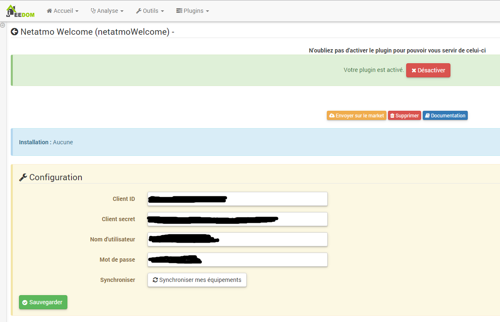
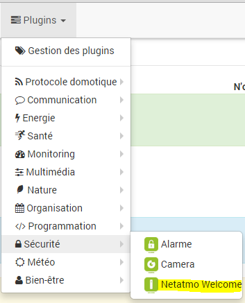
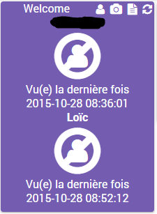
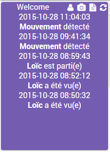

Plugin permettant de récupérer les informations des caméras Netatmo
Welcome (attention il n’y a pas le flux vidéo)

Plugin-Konfiguration
=======================

Nach der Installation des Plugin, müssen Sie Ihre Netatmo Zugangsdaten
eingeben :

-   **Kunden ID** : Ihre Kunden-ID (siehe Konfigurationsabschnitt)

-   **Kunden Schlüssel** : Ihr Kunden Schlüssel (siehe Konfigurationsabschnitt)

-   **Benutzername** : Benutzername Ihres Netatmo Kontos 

-   **Mot de passe** : mot de passe de votre compte Netatmo

-   **Synchronisieren** : ermöglicht das Synchronisieren von Jeedom mit Ihrem 
    Netamo-Konto, um Ihre Netamo-Geräte automatisch zu erkennen.
    Erst ausführen, nachdem Sie die vorherigen Einstellungen gespeichert haben.

Verbindungsdaten abrufen
==========================================

Pour intégrer votre Welcome, vous devez posséder un client\_id et un
client\_secret généré sur le site <http://dev.netatmo.com>.

Klicken sie einmal auf Start :

Anschließend auf "create an app"

Melden Sie sich mit Ihrer E-Mail und Passwort an

Füllen Sie die Felder "Name" und "Description" aus (was Sie hineinschreiben
spielt keine Rolle) :

Dann am Ende der Seite wählen Sie "I accept the terms of use" und
klicken Sie auf "Create"

Sie erhalten dann die Kunden_ID="Client-ID" und Kunden_Schlüssel="Secret
Client" zurück. Kopieren Sie die diese dann im Konfigurations Teil des
Jeedom Plugin hinein (siehe vorheriges Kapitel)

Gerätekonfiguration
=============================

La configuration des équipements Netatmo est accessible à partir du menu
plugin :

Voilà à quoi ressemble la page du plugin Netatmo (ici avec déjà 1
équipement) :

> **Tip**
>
> Comme à beaucoup d’endroits sur Jeedom, placer la souris tout à gauche
> permet de faire apparaître un menu d’accès rapide (vous pouvez à
> partir de votre profil le laisser toujours visible).

> **Note**
>
> Jeedom creer un équipement par "maison" à surveiller, si vous avez
> plusieurs Netatmo Welcome dans la même maison vous n’aurez qu’un seul
> équipement par contre les informations de toutes vos welcome seront
> utilisées

Une fois que vous cliquez sur un équipement vous obtenez :

Sie werden hier alle die Konfiguration Ihrer Geräte finden:

-   **Name des Netatmo Gerätes** : Name Ihrer Netatmo Geräte 
    Welcome

-   **Übergeordnete Objekt** zeigt das übergeordnete Objekt gehört
    Ausrüstung

-   **Aktivieren**: auf Ihre aktiven Geräte machen

-   Visible ** **: macht es sichtbar auf dem Armaturenbrett

Im unteren Bereich finden sie eine Liste der Befehle :

-   le nom de la commande

-   Chronik : erlaubt das Archivieren der Daten

-   Erweiterte Konfiguration (kleine Zahnräder) : Erlaubt die erweiterte
    Konfiguration des Befehls anzuzeigen (Methode der
    Archivierung, Widget ...)

-   Test: prüft den Befehl

> **Note**
>
> Au niveau des commandes Jeedom en creer 2 par personnes déclaré dans
> la camera netatmo, une pour la date ou la personne a été apercu pour
> la derniere fois et une pour la présence ou non de la personne. Il y a
> ensuite 3 commandes par camera pour voir leur statut. Enfin une
> derniere commande affiche les 5 derniers évènement.

Widget 
======

Voici le widget sur le dashboard, ici la partie présence :

La partie statut :

La partie évènements :

Et en mobile :

La partie statut :

La partie évènements :

