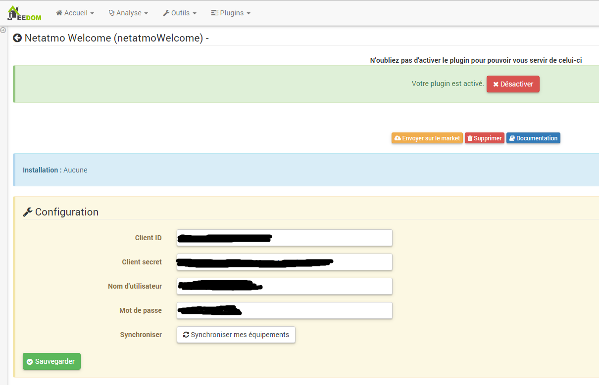
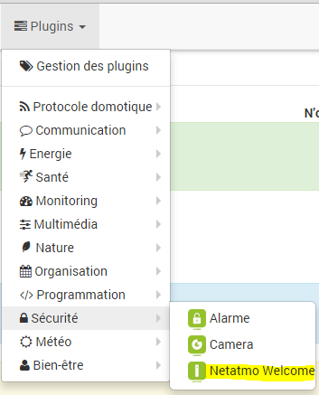
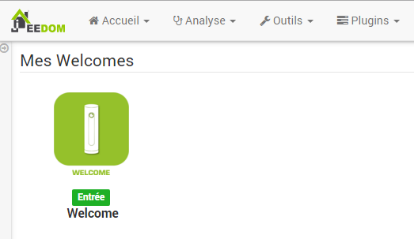
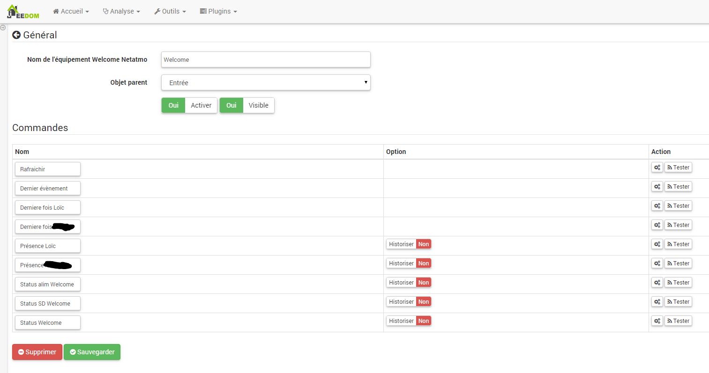
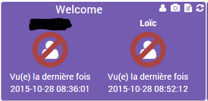
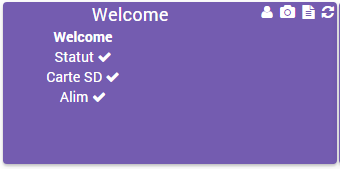
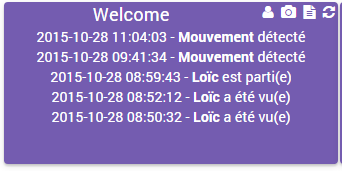
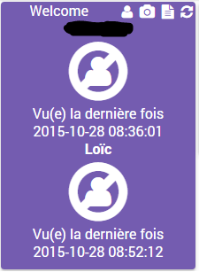
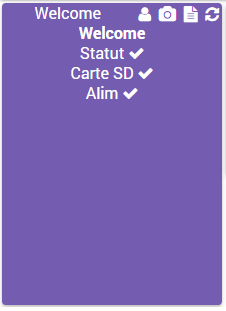
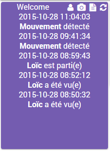

Plugin permettant de récupérer les informations des caméras Netatmo
Welcome (attention il n’y a pas le flux vidéo)

== Plugin configuration

Une fois le plugin installé, il vous faut renseigner vos informations de
connexion Netatmo :

-   **Client ID** : votre client ID (voir partie configuration)

-   **Client secret** : votre client secret (voir partie configuration)

-   **Nom d’utilisateur** : nom d’utilisateur de votre compte netatmo

-   **Mot de passe** : mot de passe de votre compte Netatmo

-   **Synchroniser** : permet de synchroniser Jeedom avec votre compte
    Netamo pour découvrir automatiquement vos équipements Netamo. A
    faire après avoir sauvegardé les paramètres précedent.

Recupération des informations de connexion 
==========================================

Pour intégrer votre Welcome, vous devez posséder un client\_id et un
client\_secret généré sur le site <http://dev.netatmo.com>.

Une fois dessus cliquez sur start :

Puis sur "create an app"

Identifiez vous, avec votre mail et mot de passe

Remplissez les champs "Name" et "Description" (peux importe ce que vous
mettez ca n’a aucune importance) :

Puis tout en bas de la page cochez la case "I accept the terms of use"
puis cliquez sur "Create"

Recuperer les informations "CLient id" et "Client secret" et copier les
dans la partie configuration du plugin dans Jeedom (voir chapitre
précedent)

Equipment configuration
=============================

La configuration des équipements Netatmo est accessible à partir du menu
plugin :

Voilà à quoi ressemble la page du plugin Netatmo (ici avec déjà 1
équipement) :

> **Tip**
>
> Comme à beaucoup d’endroits sur Jeedom, placer la souris tout à gauche
> permet de faire apparaître un menu d’accès rapide (vous pouvez à
> partir de votre profil le laisser toujours visible).

> **Note**
>
> Jeedom creer un équipement par "maison" à surveiller, si vous avez
> plusieurs Netatmo Welcome dans la même maison vous n’aurez qu’un seul
> équipement par contre les informations de toutes vos welcome seront
> utilisées

Une fois que vous cliquez sur un équipement vous obtenez :

You can find here the full configuration of your device :

-   **Nom de l’équipement Netatmo** : nom de votre équipement Netatmo
    Welcome

-   **Parent Object** : means the parent object the equipment depend
    l’équipement

-   **Activer** : permet de rendre votre équipement actif

-   **Visible** : le rend visible sur le dashboard

En dessous vous retrouvez la liste des commandes :

-   le nom de la commande

-   historiser : permet d’historiser la donnée

-   configuration avancée (petites roues crantées) : permet d’afficher
    la configuration avancée de la commande (méthode
    d’historisation, widget…​)

-   Tester : permet de tester la commande

> **Note**
>
> Au niveau des commandes Jeedom en creer 2 par personnes déclaré dans
> la camera netatmo, une pour la date ou la personne a été apercu pour
> la derniere fois et une pour la présence ou non de la personne. Il y a
> ensuite 3 commandes par camera pour voir leur statut. Enfin une
> derniere commande affiche les 5 derniers évènement.

Widget 
======

Voici le widget sur le dashboard, ici la partie présence :

La partie statut :

La partie évènements :

Et en mobile :

La partie statut :

La partie évènements :

