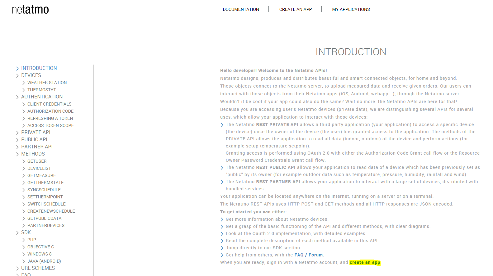

Plugin to retrieve information from Netatmo Security equipment

# Plugin configuration

Once the plugin is installed, you need to fill in your information
Netatmo connection :

-   **Client ID** : your client ID (see configuration section)

-   **Client secret** : your secret client (see configuration section)

-   **Username** : username of your netatmo account

-   **Password** : password for your Netatmo account

-   **Synchroniser** : allows you to synchronize Jeedom with your account
    Netamo to automatically discover your Netamo equipment. AT
    do after saving the previous settings.

# Retrieving connection information

To integrate your Welcome, you must have a client\_id and a
client\_secret généré sur le site <http://dev.netatmo.com>.

Once on click on start :

Then on "create an app"

Identify yourself, with your email and password

Fill in the "Name" and "Description" fields (whatever you want
put it doesn't matter) :

Then at the bottom of the page check the box "I accept the terms of use"
then click on "Create"

Retrieve the "CLient id" and "Secret client" information and copy the
in the configuration part of the plugin in Jeedom (see chapter
previous)

# Equipment configuration

The configuration of Netatmo equipment is accessible from the menu
plugin -> Security -> Netatmo Security

Once you click on a device you will find here all the configuration of your equipment :

-   **Name of the Netatmo device** : name of your Netatmo equipment
-   **Parent object** : indicates the parent object to which the equipment belongs
-   **Activer** : makes your equipment active
-   **Visible** : makes it visible on the dashboard

Below you find the list of orders :

-   the name of the command
-   Historize : allows to historize the data
-   advanced configuration (small notched wheels) : Displays
    advanced configuration of the command (logging method, widget, etc.)
-   Test : Used to test the command

# FAQ

>**I do not have the events in real time but after 15min**
>
>To have a real-time return of events (fire alarm triggering, person passing in front of the camera ..) you MUST ABSOLUTELY have your jeedom have an external URL in https with a valid certificate on port 443 (and only this port). It is an obligation imposed by netatmo

>**I cannot deactivate / activate surveillance**
>
>Attention if you put a code this function is not possible by the jeedom plugin
