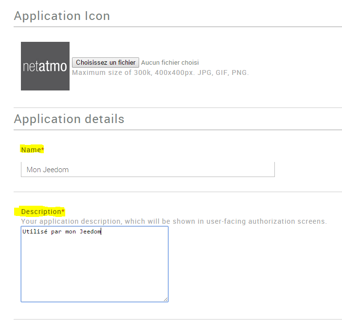

# Plugin configuration

 :

-   **Client ID** : 

-   **Client secret** : 

-   **Username** : 

-   **Password** : 

-   **Synchronize** : 
    
    .

# 

:>.

 :

"

 :

"
"

# Equipment configuration

 :

-   **** : 
-   **Parent object** : indicates the parent object to which the equipment belongs
-   **Activate** : makes your equipment active
-   **Visible** : makes it visible on the dashboard

Below you find the list of orders :

-   
-   Historize : allows to historize the data
-   advanced configuration (small notched wheels) : Displays
    
-   Test : Used to test the command

# FAQ

>****
>
>. 

>****
>
>
